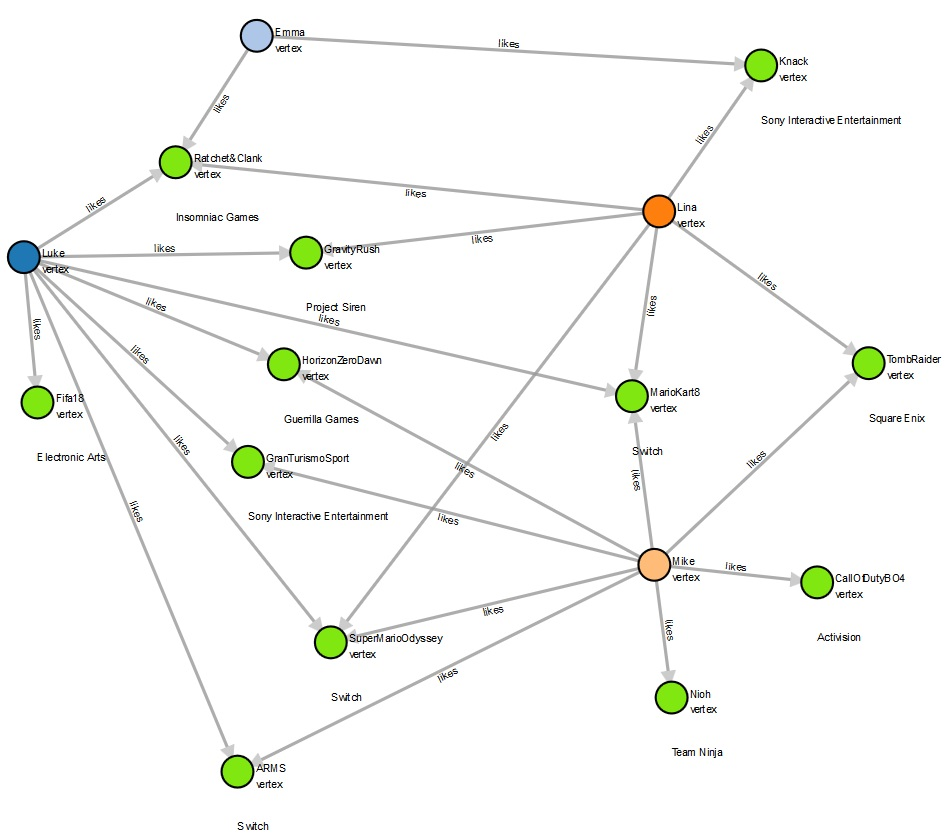

## Introduccion

En esa imagen pensando en tablas como calcularian la edad promedio del software de todos los conocidos de una persona.


#### SQL
1. Personas conocen Personas, es una relacion muchos a muchos con la tabla Conocen como pivote.
2. Personas crean Projectos, es una relacion muchos a muchos y debe tener una tabla intermedia.
3. Terminamos con 4 tablas (Persons, Created, Projects, Knowns)
4. La query se veria algo asi.

```
 ResultSet result = statement.executeQuery(
   "SELECT AVG(pr." + property + ") as AVERAGE FROM PERSONS p1" +
   "INNER JOIN KNOWS K ON k. person1 pl.id +
   "INNER JOIN PERSONS P2 ON p2.id k.person2 +
   "INNER JOIN CREATED C ON c.person = p2.id " +
   "INNER JOIN PROJECTS Pr ON pr.id c.project
   "WHERE p.name " + name + "');
   
 double avg = result.next().getDouble("AVERAGE");
```

#### Gremlin
Todo son nodos y vertices.
```
  double avg = g.V().has("name",name).
         out("knows").out("created").
         values(property).mean().next();
```

## Veamos unos ejemplos de bases de datos.



Vamos a cargar la data de vertices y aristas.

- Creen un notebook de python3 
- Adicionen los [Vertices](Vertices.gremlin)
- Adicionen las [Aristas](Aristas.gremlin)

## Comandos

Label Person vs Game
```
g.addV('person').property(id, 'Luke').property('GamerAlias', 'skywalker123').next()
g.addV('game').property(id, 'HorizonZeroDawn').property('GameGenre', 'Adventure').next()
g.V().count()
```

Que diferencia las 3 primeras
```
g.V().hasId('Luke').as('origen').V().hasId('Fifa18').addE('likes').from('origen').property('weight', 0.1).next()
g.V().hasId('Luke').as('origen').V().hasId('Fifa18').addE('likes').to('origen').property('weight', 0.1).next()
g.V().hasId('Fifa18').as('origen').V().hasId('Luke').addE('likes').from('origen').property('weight', 0.1).next()
g.E()
g.E().count()
```

Inicio ADL

```
g.V()
g.V().count()
g.E()
g.E().count()
```

Que es un out, que es un in?
```
g.V().hasId('Luke').out()
g.V().hasId('Fifa18').in()
g.V().hasId('Luke').out().in()
```

Borrare todo de mi base de datos
```
g.V().drop().iterate()
```
